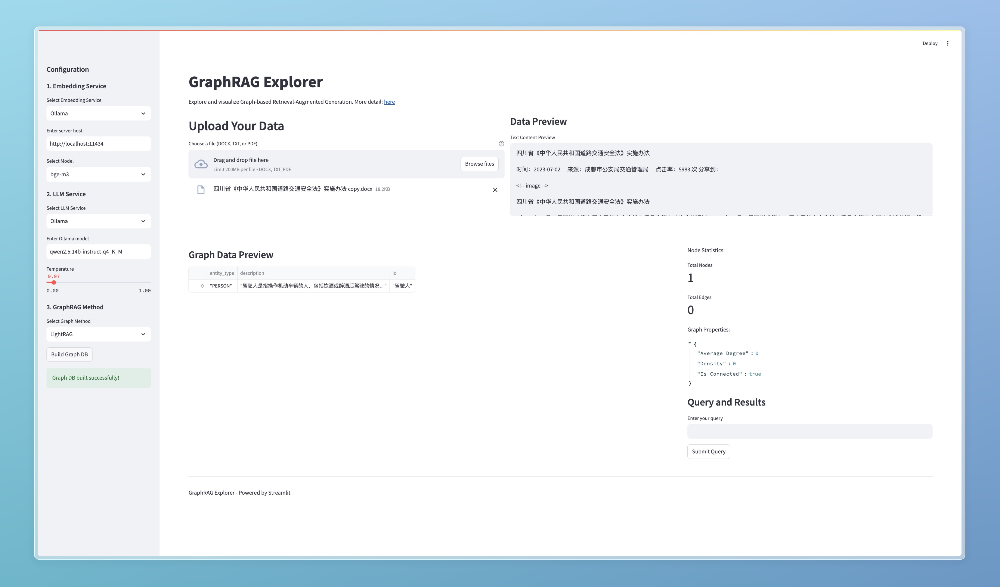

# GraphRAG Explorer 🔍

A powerful Streamlit-based application for exploring and visualizing Graph-based Retrieval-Augmented Generation (GraphRAG). This tool helps researchers and developers understand and analyze their RAG implementations through interactive graph visualizations.

## 🌟 Features

### Data Processing
- Support for multiple file formats:
  - CSV (structured data)
  - TXT (raw text)
  - PDF (coming soon)
- Real-time data preview
- Error handling and validation

### Embedding Services
- OpenAI embeddings
- Sentence Transformers
- Ollama models

### LLM Integration
- OpenAI GPT models
- Ollaam models
- Adjustable parameters (temperature, etc.)

### Graph Analysis
- Multiple analysis methods:
  - Node Importance Analysis
  - Path Analysis
  - Subgraph Extraction
- Centrality measures:
  - Degree Centrality
  - Betweenness Centrality
  - PageRank

### Visualization
- Interactive graph visualization
- Real-time graph statistics
- Property analysis
- Customizable graph layouts

## 🚀 Quick Start

### Prerequisites
- Python 3.10+
- pip package manager

### Installation

1. Clone the repository:
```bash
git clone <repository-url>
cd graphrag_explorer
```

2. Create and activate a virtual environment:
```bash
python -m venv venv
source venv/bin/activate  # On Windows: venv\Scripts\activate
```

3. Install dependencies:
```bash
pip install -r requirements.txt
```


### Running the Application

1. Start the Streamlit app:
```bash
streamlit run app.py
```

2. Open your browser and navigate to `http://localhost:8501`

3. Demo


## 📊 Usage Guide

1. **Data Upload**
   - Upload your document or dataset using the file upload section
   - Supported formats: CSV, TXT (PDF coming soon)
   - Preview your data before processing

2. **Configure Services**
   - Select your preferred embedding service
   - Choose an LLM model
   - Adjust model parameters as needed

3. **Select Analysis Method**
   - Choose your preferred graph analysis method
   - Configure analysis parameters
   - View results in real-time

4. **Explore Visualization**
   - Interact with the graph visualization
   - Analyze node and edge statistics
   - Export results if needed

## 🛠️ Configuration

### Supported Embedding Models
- **OpenAI**: OpenAI-like services
- **Ollama**: Various models
- **Sentence Transformers**: all-MiniLM-L6-v2, all-mpnet-base-v2

### Supported LLM Models
- **OpenAI**: OpenAI-like services
- **Ollama**: Various models


## 📝 Contributing

Contributions are welcome! Please feel free to submit a Pull Request.

1. Fork the repository
2. Create your feature branch
3. Commit your changes
4. Push to the branch
5. Open a Pull Request

## 📄 License

This project is licensed under the MIT License - see the LICENSE file for details.

## 🤝 Support

If you encounter any issues or have questions:
- Open an issue in the GitHub repository

## 🙏 Acknowledgments

- Streamlit for the amazing framework
- NetworkX for graph processing
- The RAG and LLM communities for inspiration
